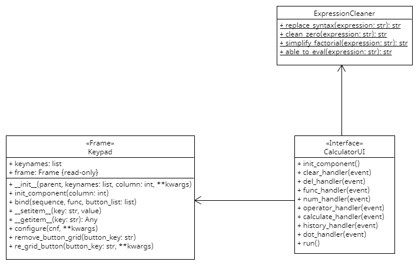

## Basic Calculator

---
A basic calculator with basic mathematical symbol and function with history of what you have calculated. You can find your history in the top-left corner of the screen which labeled as History, just click it and the expression will fill the current field automatically

## How to run?

---
* First you need to install pygame package by type the following command below in terminal
```
pip install pygame
```
* Download these file below and put them in the same folder
    * [calculator_app.py](https://github.com/0CreepySmile0/calculator/blob/main/calculator_app.py)
    * [calculator_ui.py](https://github.com/0CreepySmile0/calculator/blob/main/calculator_ui.py)
    * [cleaner.py](https://github.com/0CreepySmile0/calculator/blob/main/cleaner.py)
    * [keypad.py](https://github.com/0CreepySmile0/calculator/blob/main/keypad.py)


* Run **calculator_app.py** on your environment
## Diagram

---
Here's a diagram of all classes used



**Note:**
* History contain only 5 recent result
* Please try not to input something **_weird_**, or else **_reduce_** your **_sound volume_**
